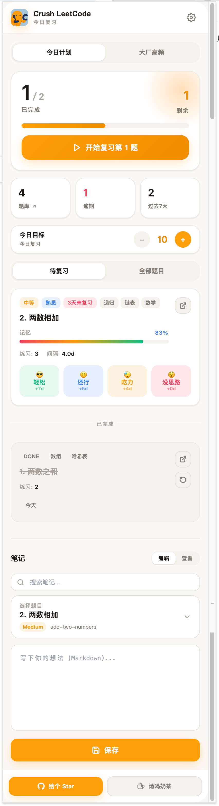
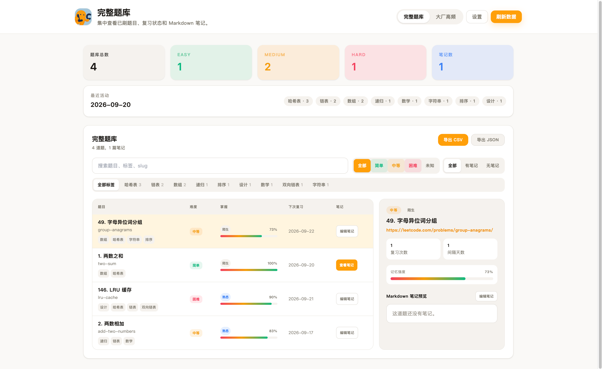
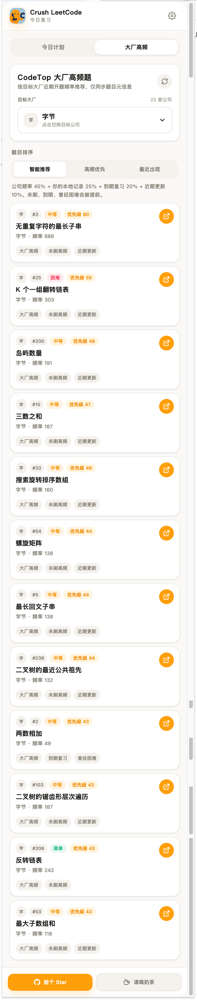

<div align="center">
  

  <h1>Crush LeetCode</h1>

  <p><strong>把刷过的 LeetCode 题，变成真正会做的题。</strong></p>
  <p>一个本地优先的 LeetCode 间隔复习 Chrome 扩展。</p>

  <p>
    <a href="https://github.com/oldtommmy/crush_leetcode"></a>
    <a href="https://github.com/oldtommmy/crush_leetcode/releases"></a>
    
    
    
  </p>

  <p>
    <a href="#快速开始">快速开始</a> ·
    <a href="#界面一览">界面一览</a> ·
    <a href="#数据与隐私">数据与隐私</a> ·
    <a href="#english-at-a-glance">English</a> ·
    <a href="#开发">开发</a>
  </p>
</div>

---

## 为什么是 Crush LeetCode

刷题的难点不只是 AC，而是让做过的题在真正需要时还能想起来。

Crush LeetCode 把复习直接放回 LeetCode 工作流：提交通过后给出掌握反馈，依据反馈安排下一次复习；当天该复习什么、哪些题逾期、哪些公司高频还没覆盖，打开扩展就能看到。

<table>
  <tr>
    <td width="33%" align="center"><strong>1. 提交通过</strong><br/>自动识别 LeetCode 与 LeetCode CN 的 Accepted 提交。</td>
    <td width="33%" align="center"><strong>2. 给出反馈</strong><br/>按“轻松 / 还行 / 吃力 / 没思路”记录真实掌握程度。</td>
    <td width="33%" align="center"><strong>3. 按计划复习</strong><br/>用 FSRS 节奏安排下一次回顾，而不是凭感觉猜。</td>
  </tr>
</table>

## 界面一览

<table>
  <tr>
    <td align="center">
      <strong>Accepted 后即时反馈</strong><br/>
      <sub>一次选择，决定更合适的下次复习时间。</sub><br/><br/>
      
    </td>
    <td align="center">
      <strong>今日复习计划</strong><br/>
      <sub>进度、逾期、待复习题与笔记在一个紧凑面板中。</sub><br/><br/>
      
    </td>
  </tr>
  <tr>
    <td align="center">
      <strong>完整题库与笔记</strong><br/>
      <sub>按难度、标签、掌握度筛选，并把思路沉淀在题目旁。</sub><br/><br/>
      
    </td>
    <td align="center">
      <strong>大厂高频题</strong><br/>
      <sub>按公司浏览高频题，快速补齐本地题库覆盖。</sub><br/><br/>
      
    </td>
  </tr>
  <tr>
    <td colspan="2" align="center">
      <strong>可控的设置</strong><br/>
      <sub>主题、语言、提醒、备份和悬浮 Logo 大小都可按习惯调整。</sub><br/><br/>
      
    </td>
  </tr>
</table>

## 核心能力

### 自动记录，按掌握程度复习

- **AC 后自动入库**：支持 `leetcode.com` 和 `leetcode.cn`，提交通过即可进入复习流程。
- **FSRS 间隔复习**：根据每次反馈动态调整下一次复习日期，不使用固定、僵硬的间隔。
- **今日计划**：在 Popup 中查看待复习、已完成、逾期数量与最近 7 天表现。
- **复习评分可回溯**：每题保留复习次数、记忆强度与计划间隔，帮助判断真正薄弱的题。

### 题库、高频题与 Markdown 笔记

- **完整本地题库**：按难度、标签、是否有笔记和掌握度筛选；可查看题目详情与复习状态。
- **大厂高频题**：按公司查看高频题，并与本地题库匹配，区分已做与待补题目。
- **每题独立 Markdown 笔记**：从题目页、Popup 或题库记录思路、坑点与复杂度，并支持预览与导出。
- **悬浮 Logo 快捷入口**：题目页 Logo 支持拖拽定位；左键进入评分，右键打开笔记，并提供小号、默认、大号三档大小。

### 提醒、备份和自主控制

- **桌面提醒与本地周报**：按设定时间提醒复习，也可导出本地 HTML 周报。
- **导入导出**：支持 JSON 备份、导入前预览与 Markdown 笔记导出，换设备也能带走积累。
- **可选云同步**：仅在你主动开启并设置恢复码后使用；日常使用不依赖云端。
- **中英双语与主题**：支持中文 / English，以及浅色、深色与跟随系统主题。

## 快速开始

### 安装

1. 从 [Releases](https://github.com/oldtommmy/crush_leetcode/releases) 下载最新 ZIP 并解压。
2. 在 Chrome 打开 `chrome://extensions/`。
3. 开启右上角的 **开发者模式**。
4. 选择 **加载已解压的扩展程序**，并选择解压后的目录。

### 第一次使用

1. 正常完成一道 LeetCode 题并提交。
2. Accepted 后选择当前真实感受：`轻松`、`还行`、`吃力` 或 `没思路`。
3. 打开扩展 Popup，开始当天的复习计划；需要时为题目补充 Markdown 笔记。
4. 在设置页配置提醒、主题、备份和悬浮 Logo 大小。

## 数据与隐私

Crush LeetCode 默认以 **浏览器本地存储** 为中心。你的题目记录、复习日志和笔记不会因为浏览大厂高频题而上传。

<details>
  <summary><strong>查看数据处理说明</strong></summary>
  <br/>

  - **本地题库匹配**：大厂高频功能只用浏览器本地题库进行匹配，不上传题目记录、笔记、代码或复习日志。
  - **备份可带走**：可随时导出 JSON 备份与 Markdown 笔记；导出会排除云同步恢复码、邮箱和访问码等敏感字段。
  - **云同步是可选项**：只有主动启用、设置恢复码并执行同步后，才会使用云端快照能力。
  - **恢复码请自行保管**：恢复数据需要使用同一个恢复码；建议使用足够长且不常见的组合。
</details>

## English at a glance

**Crush LeetCode** is a local-first Chrome extension that turns solved LeetCode problems into a spaced-repetition review workflow.

- Capture accepted submissions from LeetCode and LeetCode CN, then rate how well you knew the solution.
- Schedule follow-up reviews with FSRS, and see due, completed, and overdue work in a compact daily plan.
- Keep per-problem Markdown notes, browse a searchable library, and compare it with company hot-question lists.
- Own your data through local storage, JSON backup, note export, and optional opt-in cloud snapshots.

### Install

1. Download and unzip the latest package from [Releases](https://github.com/oldtommmy/crush_leetcode/releases).
2. Open `chrome://extensions/`, enable **Developer mode**, then choose **Load unpacked**.
3. Select the extracted extension directory and start solving.

## 开发

```bash
npm install
npm run dev
npm run typecheck
npm test
npm run build
```

### 项目结构

- `src/background`：Service Worker、提醒、通知、公告、同步与周报触发。
- `src/content`：LeetCode 页面识别、Accepted 监听、评分与悬浮 Logo 入口。
- `src/popup`：今日计划、紧凑题库、高频题与笔记编辑。
- `src/options`：主题、提醒、导入导出、云同步与其他设置。
- `src/library`：完整题库与大厂高频题视图。
- `src/shared`：存储、FSRS 调度、选择器、国际化、同步与共享类型。
- `tests`：存储、调度、提醒、导入导出和页面桥接等自动化测试。

### 环境变量

开发与构建时，运行时服务地址和同步配置应通过本地环境文件提供。请勿提交真实服务凭据、密钥或私人运维信息。

可选构建时配置：

- `VITE_CRUSH_CODETOP_BASE_URL`：CodeTop 元数据 API 基地址；默认值为 `https://mail.crushlc.site/codetop`。

## License

Licensed under **CC BY-NC 4.0**. Non-commercial use only.

<div align="center">
  <p><strong>如果 Crush LeetCode 对你有帮助，欢迎 Star 支持。</strong></p>
  <p><a href="https://github.com/oldtommmy/crush_leetcode">⭐ Star on GitHub</a></p>
  
</div>
