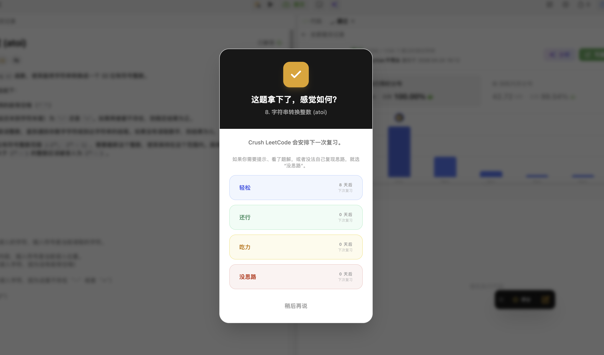
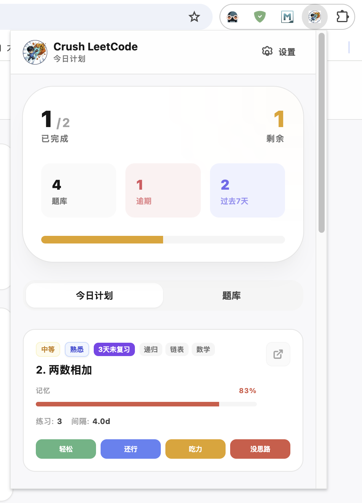
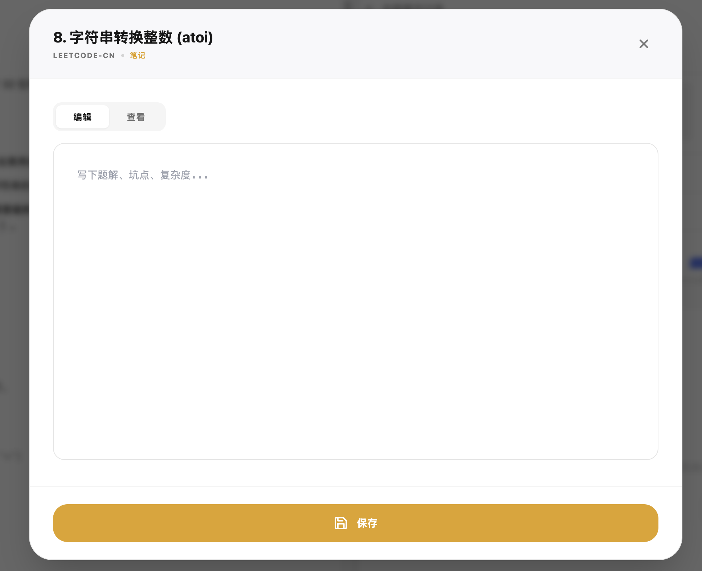
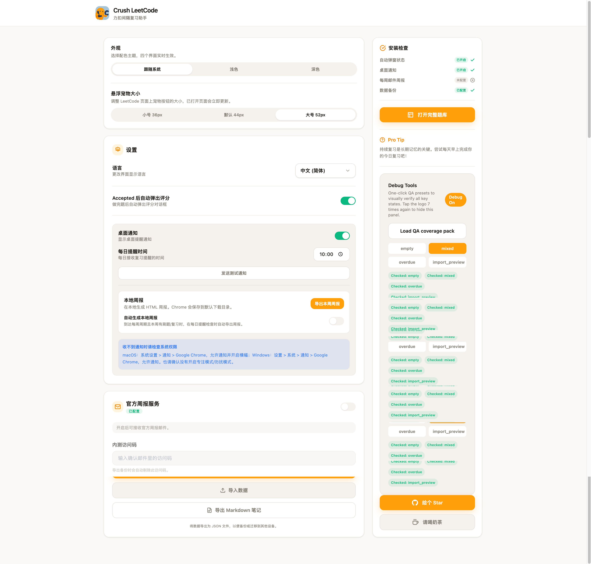

<div align="center">
  

  <h1>Crush LeetCode</h1>

  <p><strong>把刷过的 LeetCode 题，真正变成会做的题。</strong></p>
  <p><strong>Turn solved LeetCode problems into long-term memory.</strong></p>

  <p>
    <a href="https://github.com/oldtommmy/crush_leetcode"></a>
    <a href="https://github.com/oldtommmy/crush_leetcode/releases"></a>
    
    
    
  </p>

  <p>
    <a href="#中文说明">中文说明</a> ·
    <a href="#english">English</a> ·
    <a href="#development">Development</a>
  </p>
</div>

---

## 中文说明

### 项目介绍

**Crush LeetCode** 是一款 Chrome 扩展，帮助你把 LeetCode 刷题变成一个更稳定的复习流程。

它会在你提交通过后记录题目，根据你的掌握程度安排下一次复习，并提供题目笔记、今日复习列表、完整题库、桌面提醒、周报和可选云同步能力。你不用再额外维护表格，也不用靠感觉猜今天该复习什么。

### v0.0.4 beta 更新重点

- 🧯 **v0.0.4 beta.1 热修**：修复发布包 `content.js` 中 CodeTop 构建常量未替换导致题目页脚本崩溃的问题，恢复 AC 后弹窗和入库。
- ✅ **LeetCode CN AC 判定修复**：改用主世界网络监听，区分运行示例和真实提交，支持 `/v2/check/`，避免跳到下一题后弹旧题卡片。
- 🔥 **CodeTop 高频题 MVP**：新增独立 CodeTop 元信息服务，仍通过现有公开域名的同域路径提供给插件；Popup 增加“复习 / 高频”分段入口，完整题库页顶层支持“完整题库 / 大厂高频”切换。
- 🛡️ **本地匹配与隐私边界**：高频题只和浏览器本地题库匹配，不上传题库、笔记、代码或复习日志；服务端只同步 CodeTop 题目元信息，不保存完整题面。
- 🧩 **AI 边界预留**：本版不提供用户可见 LLM 功能，仅预留 AI 总结 / 计划所需的数据类型边界，后续版本再接 Provider。

### 核心功能

| 功能 | 说明 |
| --- | --- |
| AC 自动记录 | 支持 `leetcode.com` 和 `leetcode.cn`，通过后自动弹出评分面板。 |
| 智能复习计划 | 基于 `FSRS` 间隔重复算法，按你的掌握情况安排下次复习。 |
| 今日复习 | Popup 中展示今天该复习的题、已完成题和逾期题。 |
| 高频推荐 | Popup 中按公司查看 CodeTop 高频题，并结合本地复习记录生成推荐原因。 |
| 完整题库 | 独立页面支持“完整题库 / 大厂高频”顶层切换，可查看本地题库筛选、掌握度、详情、笔记和高频覆盖。 |
| Markdown 笔记 | 每道题都可以写独立笔记，支持预览、编辑和本地导出。 |
| 官方公告 | 支持从远端服务读取公告、版本提示、仓库链接和下载链接。 |
| 提醒和周报 | 支持桌面提醒，也可以配置邮箱接收复习周报。 |
| 数据备份 | 支持导出 / 导入 JSON，并在导入前预览数据变化。 |
| 可选云同步 | 用户主动开启后，可通过恢复码把数据同步到云端快照。 |
| 双语与主题 | 支持中文 / English，以及浅色、深色、跟随系统主题。 |

### 为什么适合刷题复习

- **贴近 LeetCode 工作流**：直接运行在题目页、Popup 和设置页中，不需要切换到额外工具。
- **复习节奏更具体**：不是简单按固定天数提醒，而是根据每次掌握反馈调整间隔。
- **题库和笔记连在一起**：题目、评分、复习日志、掌握进度和 Markdown 笔记围绕同一道题沉淀。
- **数据可带走**：JSON 备份、Markdown 笔记导出和可选云同步，降低换设备或重装浏览器的成本。
- **远程配置可迭代**：公告和每日完成文案可以由服务端更新，不必每次都重新发插件包。

### 截图

<div align="center">

| 评分弹窗 | 掌握度看板 |
|:---:|:---:|
|  |  |

| Markdown 笔记 | 设置页面 |
|:---:|:---:|
|  |  |

</div>

### 安装使用

1. 打开 [Releases](https://github.com/oldtommmy/crush_leetcode/releases)，下载最新的 zip 包并解压。
2. 在 Chrome 地址栏打开 `chrome://extensions/`。
3. 开启右上角 **Developer mode / 开发者模式**。
4. 点击 **Load unpacked / 加载已解压的扩展程序**，选择解压后的目录。

### 使用流程

1. 在 LeetCode 正常做题并提交。
2. Accepted 后选择你的掌握程度：`完全没思路`、`困难`、`一般`、`轻松`。
3. 打开扩展 Popup 查看今日复习计划、高频推荐和官方公告。
4. 在题目页、Popup 或完整题库页记录 Markdown 笔记。
5. 在设置页配置提醒、周报邮箱、导入导出、笔记导出和可选云同步。

### 云同步说明

云同步是可选功能。开启后，扩展会在题目记录、笔记、复习状态等数据变化时尝试自动上传云端快照；你也可以在设置页手动上传或恢复。

- **恢复码由用户自己设置**：建议使用邮箱加一段私有后缀，例如 `name@example.com-crush-2026-private`。
- **恢复码需要记住**：恢复数据时必须输入同一个恢复码，插件和服务端不会保存明文恢复码。
- **避免过短或过常见**：恢复码太简单会增加碰撞和误恢复风险。
- **同步的是快照**：当前版本以整体数据快照为主，后续会继续优化冲突合并和端到端加密体验。

### 后续优化方向

- **更强的数据存储**：升级到 `IndexedDB`，让大量题目和笔记也能保持流畅。
- **更细的同步策略**：补充冲突合并、同步历史、数据加密和更友好的恢复流程。
- **更直观的复习分析**：展示薄弱标签、逾期趋势和容易忘的题。
- **AI 总结 / 计划边界**：当前仅保留数据类型边界，后续版本接入 Provider 后再开放用户可见体验。
- **自动化发布**：用 `GitHub Actions` 自动测试、构建和打包发布版本。

---

## English

### Project Introduction

**Crush LeetCode** is a Chrome extension that helps you turn LeetCode practice into a repeatable review system.

After you submit an accepted solution, it records the problem, schedules the next review based on your mastery level, and provides problem notes, today's review list, a full problem library, desktop reminders, weekly reports, and optional cloud sync. You no longer need to maintain a separate spreadsheet or guess what to review today by feel.

### v0.0.4 beta Highlights

- 🧯 **v0.0.4 beta.1 hotfix**: Fixes a release-package issue where the CodeTop build-time constant was not replaced in `content.js`, which could crash the problem-page script and prevent Accepted popups and library insertion.
- ✅ **LeetCode CN accepted detection fix**: Uses main-world network observation, separates run-code checks from real submissions, supports `/v2/check/`, and avoids stale cards after navigation.
- 🔥 **CodeTop hot question MVP**: Adds an independent CodeTop metadata service exposed to the extension through the existing public same-origin path; the popup now has Review / Hot segmented tabs, and the library page can switch between Full Library / Company Hot List.
- 🛡️ **Local matching and privacy boundary**: Hot questions are matched only with the browser-local library. Local problems, notes, code, and review logs are never uploaded; the backend stores CodeTop metadata only, not full problem content.
- 🧩 **AI boundary only**: This release does not ship user-visible LLM functionality. It only reserves data type boundaries for future AI summaries and plans, with provider integration deferred to a later version.

### Core Features

| Feature | Description |
| --- | --- |
| Accepted auto-recording | Supports `leetcode.com` and `leetcode.cn`, and shows a rating panel after an accepted submission. |
| Smart review plan | Uses the `FSRS` spaced repetition algorithm to schedule the next review based on your mastery feedback. |
| Today's review | Shows problems due today, completed problems, and overdue problems in the popup. |
| Hot recommendations | View CodeTop company hot questions in the popup, with local recommendation reasons from your review history. |
| Full problem library | Switch between Full Library / Company Hot List in the standalone page, with local filters, mastery, details, notes, and hot-list coverage. |
| Markdown notes | Each problem can have its own note, with preview, editing, and local export. |
| Official announcements | Reads announcements, version notices, repository links, and download links from the remote service. |
| Reminders and weekly reports | Supports desktop reminders and optional weekly review emails. |
| Data backup | Supports JSON export/import and previews data changes before import. |
| Optional cloud sync | After users opt in, data can be synced to cloud snapshots with a recovery code. |
| Bilingual and theme | Supports Chinese / English, plus light, dark, and system themes. |

### Why It Fits LeetCode Review

- **Close to the LeetCode workflow**: It runs directly on problem pages, the popup, and Settings, so you do not need to switch to another tool.
- **A more concrete review rhythm**: It does not simply remind you after fixed intervals; it adjusts the interval based on your mastery feedback each time.
- **The library and notes stay connected**: Problems, ratings, review logs, mastery progress, and Markdown notes all accumulate around the same problem.
- **Your data can move with you**: JSON backup, Markdown note export, and optional cloud sync reduce the cost of changing devices or reinstalling the browser.
- **Remote configuration can iterate**: Announcements and daily completion messages can be updated from the server without rebuilding the extension every time.

### Screenshots

<div align="center">

| Rating Modal | Dashboard |
|:---:|:---:|
|  |  |

| Markdown Notes | Settings |
|:---:|:---:|
|  |  |

</div>

### Installation and Usage

1. Download the latest zip from [Releases](https://github.com/oldtommmy/crush_leetcode/releases) and unzip it.
2. Open `chrome://extensions/` in Chrome.
3. Enable **Developer mode**.
4. Click **Load unpacked** and select the extracted folder.

### Usage Flow

1. Solve and submit problems on LeetCode as usual.
2. After Accepted, choose your mastery level: `No clue`, `Hard`, `Normal`, or `Too easy`.
3. Open the extension popup to review today's plan, hot recommendations, and official announcements.
4. Write Markdown notes from the problem page, popup, or full library page.
5. Configure reminders, weekly digest email, import/export, notes export, and optional cloud sync from the settings page.

### Cloud Sync Notes

Cloud sync is optional. Once enabled, the extension tries to upload a cloud snapshot after key local data changes. You can also upload or restore manually from Settings.

- **The recovery code is set by the user**: An email plus a private suffix is recommended, for example `name@example.com-crush-2026-private`.
- **The recovery code must be remembered**: Restoring data requires the same code. The extension and service do not store the plaintext recovery code.
- **Avoid short or common codes**: Weak codes increase collision and accidental-restore risk.
- **Sync currently uses snapshots**: This version mainly syncs whole data snapshots. Conflict merging and end-to-end encryption will continue to improve later.

### Future Optimization Directions

- **Stronger data storage**: Move large amounts of problems and notes to `IndexedDB` so the extension remains smooth.
- **More granular sync strategy**: Add conflict merging, sync history, data encryption, and a friendlier restore flow.
- **Review analytics**: Show weak tags, overdue trends, and problems you often forget.
- **AI summary / plan boundary**: The current release keeps the data contract only; provider-backed user-visible experiences will come in later versions.
- **Automated release**: Use `GitHub Actions` to automatically test, build, package, and release versions.

---

## Development

```bash
npm install
npm run dev
npm run typecheck
npm test
npm run build
```

### Environment

Runtime service endpoints and cloud-sync credentials are provided through local environment files during development and build. Do not commit real deployment details, service keys, or private operational notes to the public repository.

Optional build-time endpoints:

- `VITE_CRUSH_CODETOP_BASE_URL`: CodeTop metadata API base URL. Defaults to `https://mail.crushlc.site/codetop`.

### Project Layout

| Path | Purpose |
| --- | --- |
| `src/background` | Service worker, alarms, notifications, announcements, sync triggers, weekly digest |
| `src/content` | LeetCode page detection, AC observer, floating UI |
| `src/options` | Settings, reminders, email digest, import/export, full library entry, cloud sync |
| `src/popup` | Daily plan, compact problem library, note editor |
| `src/library` | Standalone full problem library page |
| `src/shared` | Storage, FSRS scheduler, selectors, i18n, sync, shared UI and types |
| `tests` | Scheduler, selector, import, alarm, announcements, and delivery tests |

## License

Licensed under **CC BY-NC 4.0**. Non-commercial use only.

<div align="center">
  <p><strong>If Crush LeetCode helps you, a Star means a lot.</strong></p>
  <p><strong>如果这个项目对你有帮助，欢迎 Star 支持。</strong></p>
  
</div>
